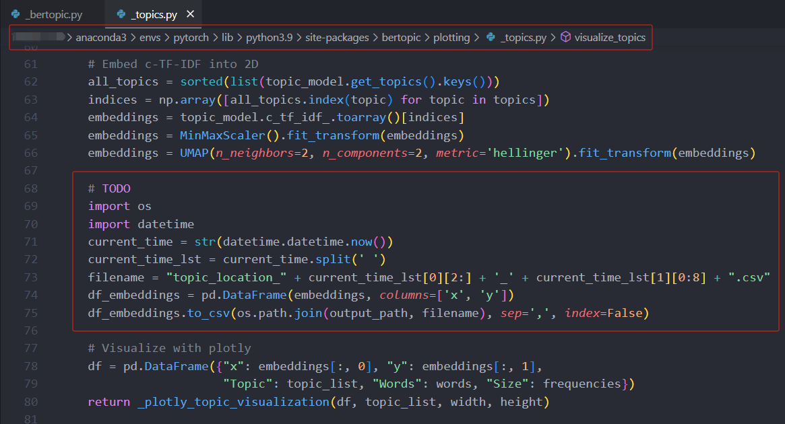

# Topic Generation

Using `run.sh` can directly generate the desired results, Note that the `fieldType` in `run.sh` needs to be changed to the field you want to generate.

```bash
bash run.sh
```

## 0. save version

If you have previously generated topic results in your `output` and `paper` directories, save them to the `version` directory.

```bash
python save_version.py
```

## 1. process text

We use BERTopic to help us generate topics. By inputting textual information composed of the `titles * 3 + abstracts` of all papers in the field, we obtain the distribution of topics in the domain and the corresponding topics for each paper.

```bash
python bertopic_title_abstract.py ${fieldType} 1
```

You can also choose to generate topic information only based on the papers of top scholars.

```bash
python bertopic_title_abstract.py ${fieldType} 2
```

> NOTE: you need to add a section of code in the BERTopic to ensure the generation of two-dimensional vectors for each topic during the execution. These vectors will serve as the x, y coordinates on the plane to generate the required parameters for the HSV color model.
>
> ```python
> import os
> import datetime
> current_time = str(datetime.datetime.now())
> current_time_lst = current_time.split(' ')
> filename = "topic_location_" + current_time_lst[0][2:] + '_' + current_time_lst[1][0:8] + ".csv"
> df_embeddings = pd.DataFrame(embeddings, columns=['x', 'y'])
> df_embeddings.to_csv(os.path.join(output_path, filename), sep=',', index=False)
> ```
> 

## 2. process word

The generated description for each topic in the above steps will consist of 10 words. We need to remove stop words such as 'a,' 'the,' etc. Additionally, some words may evolve from the same root, requiring consolidation.
If the consolidation results are unsatisfactory, you can manually merge them again. Finally, eliminate some words with minimal relevance to the topic.

```bash
python merge_word.py ${fieldType}
cp output/${fieldType}/topic_word_prob_merged.json output/${fieldType}/topic_word_prob_manual.json
python filter_word.py ${fieldType}
```

## 3. color topic

The previously obtained x-y two-dimensional vector is flattened in a planar manner, with v set to 1.

```bash
cp output/${fieldType}/topic_location_*.csv output/${fieldType}/topic_location.csv
python concat_topic.py ${fieldType}
python color_topic.py ${fieldType}
```

## 4. cluster topic

Finally, clustering is performed on the results using the KMeans algorithm to obtain top-level topics.

```bash
python cluster_topic.py ${fieldType} 11
python group_to_root.py ${fieldType} 11 1> output/${fieldType}/topic_group.txt
```
